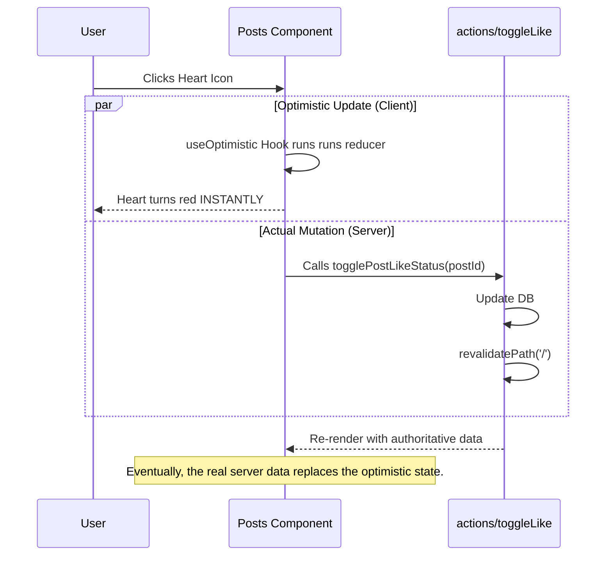

# Next.js Data Mutation Revision Guide 🎓

This project is a practical example of **mutating data** in Next.js using modern features like Server Actions and Optimistic UI. Use this guide to revise how these pieces fit together.

---

## 📚 Core Concepts Revision

### 1. Server Actions (`"use server"`)

**What & Why:** Instead of manually creating API routes (`/api/...`) and fetching from the client, Server Actions allow you to call server-side functions directly from your React components (mostly forms).
**Where to look:** [`actions/posts.js`](actions/posts.js)

- **The Directive:** Note the `"use server"` string at the top of the file. This tells Next.js: "Everything exported here can be called from the client, but it runs _only_ on the server."
- **Direct Usage:** You can pass these functions directly to the `action` prop of a `<form>`.

### 2. Handling Form State (Validation & Feedback)

**The Problem:** Server Actions run on the server. How do we get validation errors or success messages back to the client?
**The Solution:** `useFormState` hook (Server Component -> Client Component bridge).
**Where to look:** [`components/post-form.js`](components/post-form.js)

- **Setup:** `const [state, formAction] = useFormState(serverAction, initialState)`
  - `serverAction`: Your function from `actions/posts.js`.
  - `initialState`: usually `{}` or `null`.
  - `state`: The return value from the _last_ server execution (e.g., `{ errors: [...] }`).
  - `formAction`: The wrapped function you actually pass to `<form action={formAction}>`.
- **Note:** In React 19, this is renamed to **`useActionState`**.

### 3. Pending States (Loading UI)

**The Problem:** We want to disable the "Submit" button while the server is working.
**The Solution:** `useFormStatus` hook.
**Where to look:** [`components/form-submit.js`](components/form-submit.js)

- **Rule:** This hook **must** be used inside a component that is _rendered inside_ the form (a child of the form), not in the form component itself. That's why `<FormSubmit />` is its own separate component.
- **Values:** It gives you `pending` (boolean), `data` (formData), etc.

### 4. Optimistic UI (Instant Feedback)

**The Problem:** Server actions take time. Users hate waiting for a "Like" count to update.
**The Solution:** `useOptimistic` hook. Predict the future!
**Where to look:** [`components/posts.js`](components/posts.js)

- **Concept:** Show the user the result _as if_ it already succeeded. If the server fails, React automatically rolls back the UI.
- **Code Breakdown:**
  ```javascript
  const [optimisticPosts, addOptimisticPost] = useOptimistic(
    initialPosts,
    (currentPosts, newPostId) => {
      // Return the NEW state (e.g., toggle the like icon)
      // This runs immediately on the client.
    }
  );
  ```

### 5. Passing Arguments to Server Actions

**The Trick:** Sometimes you need to pass more than just `formData` (like a `postId` for toggling a like).
**Where to look:** [`components/posts.js`](components/posts.js)
**Usage:** `bind`

```javascript
// Creates a new version of the function with 'post.id' pre-filled as the first argument
action={togglePostLikeStatus.bind(null, post.id)}
```

Next.js will ensure `togglePostLikeStatus` receives `postId` first, then the `formData` (if applicable) or ignore it essentially if not a form submission strictly needing data.

### 6. Cache Revalidation

**The "Refresh":** After you mutate data (save post, toggle like), the user's browser (and Next.js's server cache) still has the old HTML.
**The Fix:** [`revalidatePath(...)`](actions/posts.js)

- Tells Next.js: "The data for this route is stale. Re-render it next time it's requested."
- Often paired with `redirect(...)` to send the user to the updated page.

---

## 🧠 Mental Model Diagrams

### **A. Creating a Post**

_Flow: Client Form -> Server Action -> DB -> Revalidate -> Redirect_

```mermaid
sequenceDiagram
    participant User
    participant Browser
    participant ServerAction as actions/createPost
    participant DB

    User->>Browser: Enters Data & Clicks Post
    Note over Browser: <FormSubmit> shows 'Posting...' (useFormStatus)
    Browser->>ServerAction: Sends FormData

    rect rgb(20, 20, 20)
    Note right of ServerAction: SERVER SIDE
    ServerAction->>ServerAction: Validate Inputs
    alt Invalid
        ServerAction-->>Browser: Return { error: [...] }
        Note over Browser: useFormState updates 'state' -> Show Errors
    else Valid
        ServerAction->>DB: Save Post
        ServerAction->>ServerAction: revalidatePath('/')
        ServerAction-->>Browser: redirect('/feed')
    end
    end
```



### **B. The "Optimistic" Like Toggle**

_Flow: Click -> update UI (instant) -> Tell Server -> Server Confirms_



---

## 🛠️ Self-Check Questions for Revision

1. Why do we need `useFormState`? (Hint: How do errors get back from the server?)
2. Can `useFormStatus` be used in the component that renders the `<form>` tag? (Hint: No, why?)
3. What does `.bind(null, id)` do when passing an action to a form?
4. If I don't call `revalidatePath`, what will the user see after a mutation?
